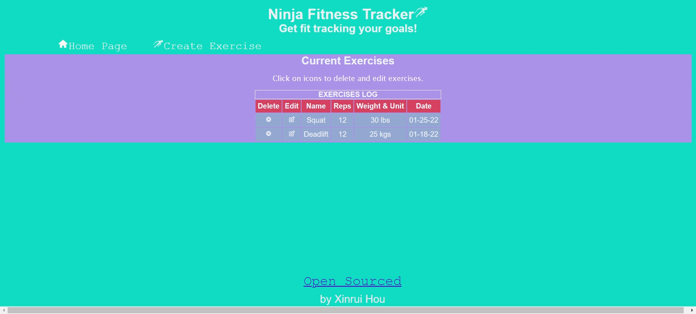

# Exercise Track MERN App
- This MERN stack app is a Single Page Application (SPA) that tracks exercises completed by the user. It demonstrates the front-end UI app using React; the back-end web service view with REST API using Node and Express for the back-end web service;  and the model layer handled by MongoDB for persistence on the server side.

- CRUD operations are implemented through REST API with the successful built of controller and model. 
 

## Technology Implemented
- Backend Technologies:
REST APIs: Implemented via Express.js to serve as the controller layer that communicates with the model layer for MongoDB database interactions.
- Frontend Technologies:
* React Hooks: Utilized useState, useEffect, and useHistory hooks to manage state and navigate between components.
* React Components: Developed specific components for tables, rows, and navigation. These are dynamically rendered and re-rendered as needed.
* React Router: Employed to maintain a Single-Page Application (SPA) architecture, minimizing server requests and simulating navigation between pages.
- Data Communication:
* Fetch API: Used on the frontend to send various HTTP requests to the server through promises, as an alternative to Axios.
- Testing:
Manual Testing: Conducted via an HTTP file for verifying functionality, instead of using Postman.
 

## Video Walkthrough

Here's a walkthrough of implemented features:

GIF created with Gifcap  
 

## MongoDB database server side

